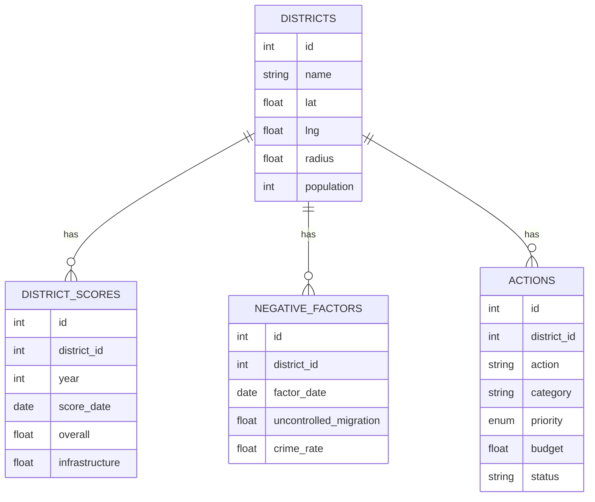

# İzmir Kentsel Dönüşüm Karar Destek Sistemi (KDS) - Backend

## 1. Projenin Amacı
Bu projenin amacı; öğrencilerin gerçekçi bir iş problemi üzerinden sunucu taraflı yazılım geliştirme, **MVC mimarisini** uygulama, **REST** prensiplerine uygun API tasarlama ve temiz kod yazma becerilerini kazanmalarını sağlamaktır.

## 2. Senaryo Tanımı
Bu sistem, İzmir ilinin ilçelerine ait kentsel dönüşüm verilerini (skorlar, negatif faktörler, trendler) analiz eden ve buna uygun aksiyon planları (önerilen projeler) sunan bir Karar Destek Sistemi (KDS) altyapısıdır. 
Yöneticiler, ilçelerin mevcut durumunu görebilir ve yeni aksiyon planları ekleyip çıkarabilirler.

## 3. Kurulum Adımları

1.  Proje klasörüne gidin:
    ```bash
    cd backend
    ```
2.  Bağımlılıkları yükleyin:
    ```bash
    npm install
    ```
3.  Çevresel değişkenleri ayarlayın:
    - `.env.example` dosyasının ismini `.env` olarak değiştirin veya yeni bir `.env` dosyası oluşturun.
    - Veritabanı bilgilerinizi buraya girin.
4.  Sunucuyu başlatın:
    ```bash
    npm run dev
    ```
    Sunucu `http://localhost:4000` adresinde çalışacaktır.

## 4. API Endpoint Listesi

| Metot | Endpoint | Açıklama |
| :--- | :--- | :--- |
| `GET` | `/api/districts-full` | Tüm ilçelerin detaylı verilerini (skorlar, faktörler, aksiyonlar) getirir. |
| `POST` | `/api/districts/:id/actions` | Bir ilçeye yeni bir aksiyon ekler. |
| `DELETE` | `/api/actions/:id` | Bir aksiyonu siler. |

### İş Kuralları (Business Rules)
1.  **Bütçe Kontrolü**: Yeni bir aksiyon eklenirken `budget` (bütçe) değeri negatif olamaz.
2.  **Silme Koruması**: Önceliği (`priority`) **'high'** (yüksek) olan aksiyonlar silinemez.

## 5. ER Diyagramı


